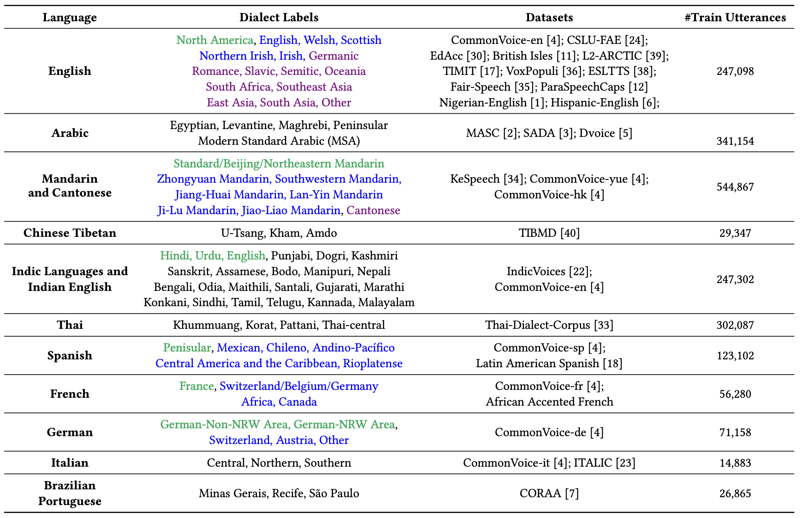
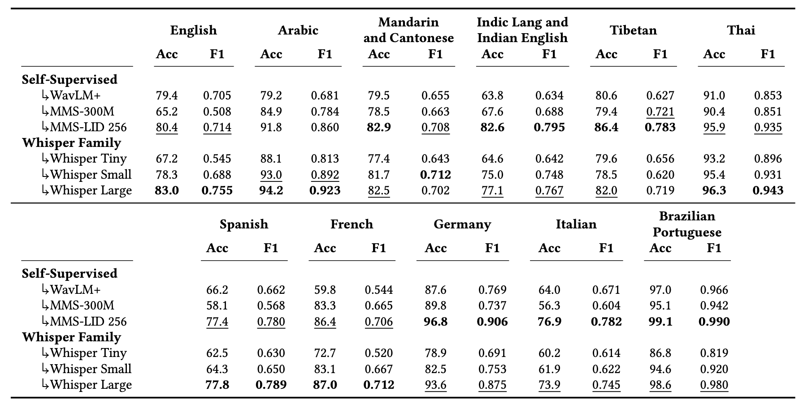

## Voxlect: A Speech Foundation Model Benchmark for Modeling Dialects and Regional Languages Around the Globe

<p align="center">
  📄 <a href=""><strong>[Preprint Paper]</strong></a> &nbsp;|&nbsp;
  🤗 <a href="https://huggingface.co/collections/tiantiaf/voxlect-whisper-large-v3-68889785dedf366a1c939e81"><strong>[HuggingFace Whisper-Large v3 Models]</strong></a> &nbsp;
  <a href="https://huggingface.co/collections/tiantiaf/voxlect-mms-lid-256-688ac8b901116efa6ad5ab0f"><strong>[HuggingFace MMS-LID-256 Models]</strong></a> &nbsp;
</p>

#### This repo presents Voxlect, a benchmark that predict dialects and regional languages worldwide using speech foundation models. 

We report benchmark evaluations on dialects and regional language varieties in *English, Arabic, Mandarin and Cantonese, Tibetan, Indic languages and Indian English, Thai, Spanish, French, German, Brazilian Portuguese, and Italian*. Our study used over 2 million training utterances from 30 publicly available speech corpora that are provided with dialectal (or accent) information. 

### Labeling Scheme
In Voxlect, we experiments with the following datasets to predict dialects or regional languages. Our labeling is described below:

<div align="center">
 
</div>

#### Our training data filters output audio shorter than 3 seconds (unreliable predictions) and longer than 15 seconds (computation limitation), so you need to cut your audio to a maximum of 15 seconds, 16kHz and mono channel. We also subsample datasets like IndicVoices and CORRA, so you may see noticeable smaller training sample size than original datasets.

### Benchmark Performance

<div align="center">
 
</div>

Compared to Vox-Profile, we use additional English speech data in ParaSpeechCaps and Timit that gains improved classification performance.

### Download Repo
```bash
git clone git@github.com:tiantiaf0627/voxlect.git
```

### Installation
```bash
conda create -n voxlect python=3.8
cd voxlect
pip install -e .
```


### Quick Example 1 - Whisper Large Mandarin Dialect and Cantonese Classification
```python
# Load libraries
import torch
import torch.nn.functional as F
from src.model.dialect.whisper_dialect import WhisperWrapper

# Label List
dialect_label_list = [
    "Jiang-Huai",
    "Jiao-Liao",
    "Ji-Lu",
    "Lan-Yin",
    "Mandarin",
    "Southwestern",
    "Zhongyuan",
    "Cantonese"
]
    
# Find device
device = torch.device("cuda") if torch.cuda.is_available() else "cpu"

# Load model from Huggingface
whisper_model = WhisperWrapper.from_pretrained("tiantiaf/voxlect-mandarin-cantonese-dialect-whisper-large-v3").to(device)
whisper_model.eval()

# Load data, here just zeros as the example
# Our training data filters output audio shorter than 3 seconds (unreliable predictions) and longer than 15 seconds (computation limitation)
# So you need to prepare your audio to a maximum of 15 seconds, 16kHz and mono channel
max_audio_length = 15 * 16000
data = torch.zeros([1, 16000]).float().to(device)[:, :max_audio_length]
whisper_logits, whisper_embeddings = whisper_model(data, return_feature=True)
    
# Probability and output
whisper_prob = F.softmax(whisper_logits, dim=1)
print(dialect_label_list[torch.argmax(whisper_prob).detach().cpu().item()])
```

### Quick Example 2 - MMS-LID-256 Spanish Dialect 
```python
# Load libraries
import torch
import torch.nn.functional as F
from src.model.dialect.mms_dialect import MMSWrapper

# Label List
spanish_dialect_list = [
    "Andino-Pacífico", 
    "Caribe and Central", 
    "Chileno",
    "Mexican", 
    "Penisular", 
    "Rioplatense", 
]
    
# Find device
device = torch.device("cuda") if torch.cuda.is_available() else "cpu"

# Load model from Huggingface
mms_model = MMSWrapper.from_pretrained("tiantiaf/voxlect-spanish-dialect-mms-lid-256").to(device)
mms_model.eval()

# Load data, here just zeros as the example
# Our training data filters output audio shorter than 3 seconds (unreliable predictions) and longer than 15 seconds (computation limitation)
# So you need to prepare your audio to a maximum of 15 seconds, 16kHz and mono channel
max_audio_length = 15 * 16000
data = torch.zeros([1, 16000]).float().to(device)[:, :max_audio_length]
mms_logits, mms_embeddings = mms_model(data, return_feature=True)
    
# Probability and output
mms_prob = F.softmax(mms_logits, dim=1)
print(spanish_dialect_list[torch.argmax(mms_prob).detach().cpu().item()])
```

#### Given that the Voxlect Benchmark paper is still under peer-review, we provide limited set of models and model weights before the review is concluded. But below are the models we currently put out.

### MMS-LID-256 Models

 Model Name  | Data  | Pre-trained Model | Use LoRa |  LoRa Rank Size  | Output | Example Code |
|--------------------------------------------------------|-------|-----------------|-----------------|-------------|------------------------|------------------------|
| [tiantiaf/voxlect-english-dialect-mms-lid-256](https://huggingface.co/tiantiaf/voxlect-english-dialect-mms-lid-256)   | 12 Datasets | mms-lid-256              | Yes              | 64              | 16 English Varieties |  |
| [tiantiaf/voxlect-spanish-dialect-mms-lid-256](https://huggingface.co/tiantiaf/voxlect-spanish-dialect-mms-lid-256)   | CommonVoice+Latin American Spanish | mms-lid-256              | Yes              | 64              | Penisular, Mexican, Chileno, Andino-Pacífico, Central America and Caribbean, Rioplatense |  |
| [tiantiaf/voxlect-mandarin-cantonese-dialect-mms-lid-256](https://huggingface.co/tiantiaf/voxlect-mandarin-cantonese-dialect-mms-lid-256)   | KeSpeech+CommonVoice-yue+CommonVoice-hk | mms-lid-256              | Yes              | 64              | Jiang-Huai,Jiao-Liao,Ji-Lu,Lan-Yin,Standard Mandarin,Southwestern,Zhongyuan,Cantonese |  |
| [tiantiaf/voxlect-indic-lid-mms-lid-256](https://huggingface.co/tiantiaf/voxlect-indic-lid-mms-lid-256)   | IndicVoices+CommonVoice-en | mms-lid-256              | Yes              | 64              | 22 Indic Languages (e.g. Hindi, Urdu, Telegu, Tamil) and Indian English |  |


### Whisper-Large V3 Models
Model Name  | Data  | Pre-trained Model | Use LoRa |  LoRa Rank Size  | Output | Example Code |
|--------------------------------------------------------|-------|-----------------|-----------------|-------------|------------------------|------------------------|
| [tiantiaf/voxlect-english-dialect-whisper-large-v3](https://huggingface.co/tiantiaf/voxlect-english-dialect-whisper-large-v3)   | 12 Datasets | whisper-large-v3              | Yes              | 64              | 16 English Varieties |  |
| [tiantiaf/voxlect-spanish-dialect-whisper-large-v3](https://huggingface.co/tiantiaf/voxlect-spanish-dialect-whisper-large-v3)   | CommonVoice+Latin American Spanish | whisper-large-v3              | Yes              | 64              | Penisular, Mexican, Chileno, Andino-Pacífico, Central America and Caribbean, Rioplatense |  |
| [tiantiaf/voxlect-mandarin-cantonese-dialect-whisper-large-v3](https://huggingface.co/tiantiaf/voxlect-mandarin-cantonese-dialect-whisper-large-v3)   | KeSpeech+CommonVoice-yue+CommonVoice-hk | whisper-large-v3              | Yes              | 64              | Jiang-Huai,Jiao-Liao,Ji-Lu,Lan-Yin,Standard Mandarin,Southwestern,Zhongyuan,Cantonese |  |
| [tiantiaf/voxlect-indic-lid-whisper-large-v3](https://huggingface.co/tiantiaf/voxlect-indic-lid-whisper-large-v3)   | IndicVoices+CommonVoice-en | whisper-large-v3              | Yes              | 64              | 22 Indic Languages (e.g. Hindi, Urdu, Telegu, Tamil) and Indian English |  |

#### Responsible Use: Users should respect the privacy and consent of the data subjects, and adhere to the relevant laws and regulations in their jurisdictions when using Voxlect.

❌ **Out-of-Scope Use**
- Clinical or diagnostic applications
- Surveillance
- Privacy-invasive applications

#### If you like our work or use the models in your work, kindly cite the following. We appreciate your recognition!
```
@article{feng2025voxlect,
  title={Voxlect: A Speech Foundation Model Benchmark for Modeling Dialects and Regional Languages Around the Globe},
  author={Feng, Tiantian and Huang, Kevin and Xu, Anfeng and Shi, Xuan and Lertpetchpun, Thanathai and Lee, Jihwan and Lee, Yoonjeong and Byrd, Dani and Narayanan, Shrikanth},
  year={2025}
}
```

```
@article{feng2025vox,
  title={Vox-Profile: A Speech Foundation Model Benchmark for Characterizing Diverse Speaker and Speech Traits},
  author={Feng, Tiantian and Lee, Jihwan and Xu, Anfeng and Lee, Yoonjeong and Lertpetchpun, Thanathai and Shi, Xuan and Wang, Helin and Thebaud, Thomas and Moro-Velazquez, Laureano and Byrd, Dani and others},
  journal={arXiv preprint arXiv:2505.14648},
  year={2025}
}
```